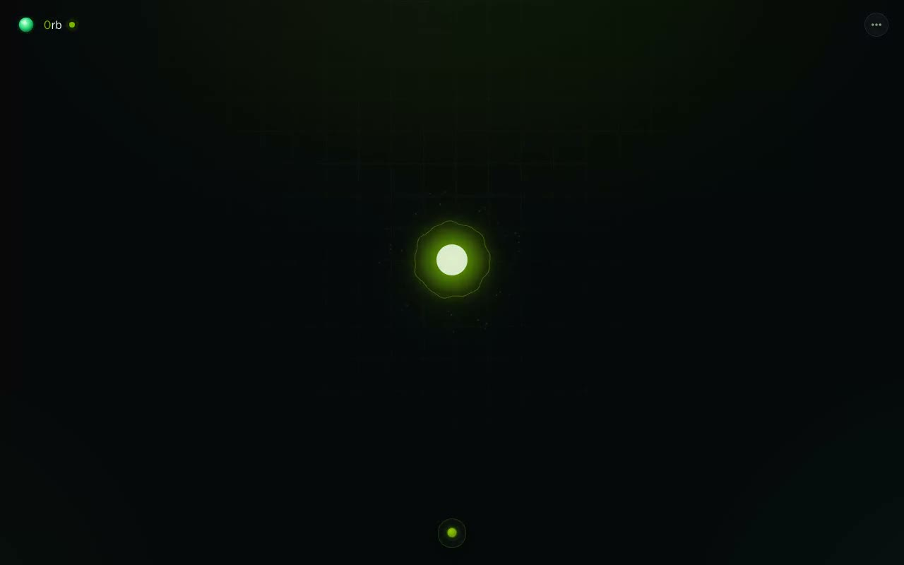

# 0rb

**A private AI for your home — brain, voice, memory, and smart home, all running
on hardware you own.**

0rb is a self-hosted agent that lives with your household instead of in a
datacenter. Talk to it by voice, message it from Telegram or WhatsApp or the
native iOS/Android apps, watch it render charts, maps, 3D scenes and entire
web apps onto its canvas. It runs your smart home end to end — pairing new
devices (it speaks Matter in both directions, so Siri controls it and it can
adopt Matter devices itself), organizing rooms, watching for trouble — knows
each member of the family by voice — and as people, with real profiles:
names, pictures, invitation links, and per-person app permissions. Every consequential
action it takes is classified, approved when it matters, logged to a receipts
ledger, and undoable.

<p align="center">
  <a href="https://orb2.app/assets/demo.mp4">
    
  </a>
  <br>
  <a href="https://orb2.app/assets/demo.mp4"><strong>▶ Watch the demo</strong></a>
  — a morning with 0rb: briefing, a kitchen timer, shopping staples, setting
  the house to away, and a map. Captured live against a running instance;
  every response is the model's own.
</p>

Designed for an **NVIDIA DGX Spark (GB10)**, but the brain is addressed through
standard OpenAI-compatible env — hardware-constrained machines run the same app
with a **cloud brain** instead. Per-platform installs (Linux / macOS / Windows /
Raspberry Pi) are in **[DEPLOYMENT.md](DEPLOYMENT.md)**.

---

## Why it's different

- **The console is not a chat window.** The whole UI is a living, audio-reactive
  green orb that *is* the agent. Tap it to talk, tap while it's speaking to
  interrupt, drag it anywhere — the page behind it is the agent's canvas, and
  everything it shows you renders as free-floating widget cards.
- **Local by default, cloud by choice.** The stock brain, voice, vision, and
  memory all run on your GPU. Pointing `OPENAI_BASE_URL` at any
  OpenAI-compatible endpoint swaps the brain live — no restart — and voice
  stays local either way.
- **A household member, not a single-user tool.** Owners and members with real
  profiles (names, pictures, invitation links), per-person preferences,
  memory, and app permissions, a family board, chore rotas, shared calendar —
  and it recognizes *who is speaking* by voice.
- **Trust is engineered, not assumed.** Every tool call passes a consent
  gradient (read / reversible / confirm / never-auto): risky actions raise an
  approval card, everything leaves a receipt with a captured inverse so
  **Undo actually undoes**, and repeated approvals can graduate into earned
  autonomy — always visible, always revocable.
- **It maintains itself.** A watchdog heals the stack, and (behind a flag) the
  agent can edit its own source, validate the build in a sandbox, and promote
  it with automatic rollback.

## Capabilities

### Brain

- **Local:** **Qwen3.8-27B** (dense, Apache 2.0, natively multimodal) served as
  the NVFP4 quant `unsloth/Qwen3.8-27B-NVFP4` on vLLM. Chosen over Meta Muse
  Glimmer 30B in a measured tool-use bake-off: **28/30 vs 16/30** correct
  calls, **3.7 s vs 19.4 s** median latency.
- **Cloud:** set `OPENAI_BASE_URL` / `OPENAI_MODEL` / `OPENAI_API_KEY`
  (Settings → General, or just ask the agent) for OpenRouter, OpenAI, or the
  **Anthropic API, spoken natively** — point the endpoint at
  `https://api.anthropic.com` with an `sk-ant-…` key and a Claude model.
  Applies live.
- **Smart router (optional):** voice turns stay on the local brain for latency,
  hard turns go to a stronger cloud model (`ORB2_ROUTER_ENABLED=1` +
  `ORB2_OPENROUTER_KEY`).

### Voice & vision

- Continuous speech with **barge-in** and **streaming TTS** — it starts
  speaking the first sentence while still thinking. GPU STT (Whisper
  large-v3-turbo on CUDA) → agent → GPU neural TTS (Kokoro), with Orpheus
  (llama.cpp) as an optional expressive engine.
- **Bilingual by design:** language is detected per utterance and per reply —
  a Spanish question gets a Spanish answer in a native Spanish voice, an
  English one stays English, with no mixing inside a reply.
- **Screenless satellites:** a Ring camera becomes a voice endpoint — say
  "hey orb" at the camera (grammar-constrained wake spotting with a self-echo
  guard) and the reply plays through the camera's speaker or the nearest
  room speaker. On/off lives in Settings.
- **A deterministic fast-path answers before the LLM.** Device commands,
  timers, house modes, time/date and "undo that" match a grammar against the
  real device list and execute in **milliseconds** (measured: reply 14 ms
  after the transcript) — the model is never invoked; anything ambiguous
  falls through to it unchanged.
- **Speaker identification:** ECAPA voice embeddings match each utterance to a
  household member, and enrollment is self-supervised — it learns your voice
  from normal use.
- **Vision:** a camera toggle streams frames straight to the multimodal brain
  as image blocks — no separate vision model.

### Canvas & widgets

- A **versioned catalog of 49 typed widgets** — charts, tables, maps,
  thermostats, document viewers, 3D models, a dedicated TV remote (inputs,
  power, volume) and a full Spotify player (now playing, Connect devices,
  playlists, search) — validated on emit, each carrying an attention tier
  (ambient → interrupt) so nothing shouts that shouldn't.
- **Pin any widget** and it persists across reloads, stays live, and joins a
  composed idle board; re-emitting a pinned id updates *your* copy (5-step
  history, revertible).
- The agent can **mint brand-new widget types at runtime** — the renderer runs
  in a CSP-locked sandbox frame (no network, postMessage only)
  ([docs/widget-plugins.md](docs/widget-plugins.md)).

### Smart home

**Direct first.** 0rb's LAN bridge discovers AirPlay speakers/TVs and network
(IPP) printers and uses them **directly — zero setup**: speak or stream audio
on any AirPlay device, print without drivers. Devices the bridge serves are
never duplicated into Home Assistant; its pending-setup queue is scrubbed
automatically so HA stays clean. The bridge also advertises the console over
mDNS so the native apps find the server by themselves.

**Home Assistant for deep control.** HA ships in the stack for everything
beyond playback and printing:

- **Control** — lights, climate, locks, covers, vacuums, plugs, scenes,
  cameras (live MJPEG), 3D printers — each with a purpose-built widget.
- **Organize** — the agent assigns areas, renames entities, hides duplicates,
  and filters diagnostic noise so only real devices surface.
- **Set up devices itself** — it drives HA's pairing config-flows with the
  same human-readable forms HA's own UI shows, and nudges you when something
  new appears that direct access doesn't already cover.
- **Watch the house** — house modes (home / away / night), arrival routines,
  instant safety alerts (smoke, water, locks), and device-health checks, all
  mode-aware so you're not spammed.

**Matter, both directions.** 0rb is a Matter **bridge** — pair it once with
Apple Home and Siri controls its lights, locks, sensors, Away Mode, and a
per-person occupancy sensor from every Apple device — and a Matter
**controller**: Settings → Home → *Add a device* takes an `MT:` code and the
orb adopts the device itself, no HA needed for simple ones. A **simulated
device fleet** (`scripts/sim-devices.sh`) exercises every one of these paths —
lights, a lock with approval/undo, sensors, deck anomalies, Apple Home — so
the flows stay tested before your hardware arrives.

### Household

- **Profiles:** members have first/last names, profile pictures, and
  join by **invitation link** (one-use, 7-day; the invitee enters their email
  and gets their sign-in code). Owners toggle **app access per member** —
  shopping, music, home control, web, memory, routines, system — enforced at
  the tool layer; the agent knows and declines gracefully.
- **Roles:** the first owner can add owners and members; critical settings
  (model, connections, access) are owner-only.
- **Family board, notes and reminders** — including presence-triggered
  delivery ("tell Ana when she gets home") and announcements to specific
  rooms' speakers.
- **Shared calendar** with recurring events, per-person **preferences** the
  agent honors automatically, and **chore rotas**.
- **Routines you can see:** "every Sunday at 5pm, plan the week's meals"
  becomes a durable object — listed, pausable, deletable — each run a real
  agent turn under your identity, with a receipt.
- **The morning deck:** on first use after local sunrise, a fresh card stack —
  weather, headlines, unread mail, today's calendar, house anomalies, chores,
  who's home — assembled at that moment, customizable per member from the
  deck itself, tuned further by 👍/👎.
- **Shopping** — a persistent list with recurring staples, buy options, and a
  checkout handoff (it never claims to have placed an order itself).

### Memory

Durable file memory + **semantic recall** (GPU embeddings + vector search) + a
relationship graph, consolidated by a periodic "dream."

### Channels & apps

**Telegram** and **WhatsApp** (link your own account by QR), native **iOS and
Android apps** (auto-discover the server at home, OTP enrollment, kiosk mode,
Siri App Intents / widgets), and **connected accounts done the TV way**:
Settings → Apps → *Your accounts* links Spotify, Google (Gmail + Calendar +
Drive in one consent), Microsoft (Outlook + Calendar + OneDrive), and Apple
(iCloud Calendar via app-specific password) — one tap, sign in, done. A
vendor-hosted relay holds the app secrets, tokens are sealed per member, and
the completion happens in a popup so it works on any network. Everything reads
through one accounts hub, so a new connection lights up mail, calendar, the
deck, and the agent at once. API keys can still just be pasted into chat —
the agent recognizes the credential's shape and files it.

### Self-evolution & self-healing

The agent can edit its own source, build it, validate it in a throwaway
sandbox, and promote it to the running instance with automatic rollback
(gated by `ORB2_SELF_MODIFY_ENABLED`). Restart policies, a watchdog, and an
optional systemd unit bring the stack back on its own after a reboot.

## Quickstart

On a fresh DGX Spark (aarch64 + NVIDIA) with Docker and the NVIDIA Container
Toolkit:

```bash
git clone https://github.com/MrQbit/0rb.git && cd 0rb
bash scripts/install.sh        # registry, .env, build, up — prompts for your owner email
```

`install.sh` is idempotent: it starts a local image registry, generates `.env`
from [`.env.example`](.env.example), builds the api / ui / whatsapp images,
reuses existing GPU images, and brings the stack up. Then:

```bash
./scripts/orb2-stack.sh up        # start the whole stack
./scripts/orb2-stack.sh status    # ps + health
./scripts/orb2-stack.sh logs orb2-api
./scripts/orb2-stack.sh heal      # tail the watchdog
```

Open **http://orb.local:9080** (the bridge claims `orb.local` on your LAN; or
**https://localhost:9443** for camera/mic). A brand-new orb shows a **claim
QR** — it belongs to whoever is standing in front of it; scan or enter the
code and you're the owner. It then introduces itself: name it, add your
people, and review what it already found on your network — every step
skippable, re-runnable from Settings. Later members join by **invitation
link**. One tap in Settings → General exports an encrypted **`.orbbackup`**
(users, memory, settings, receipts, even the Matter fabric — Apple Home
pairing survives a rebuild). No NVIDIA GPU? `scripts/preflight.sh` tells you
what your machine can run, and **[DEPLOYMENT.md](DEPLOYMENT.md)** covers the
cloud-brain install for Mac, Windows, and Raspberry Pi.

## The stack

One Docker Compose stack ([`docker-compose.spark.yml`](docker-compose.spark.yml)),
all services on one network, each with a healthcheck and restart policy:

| Service | Role | GPU |
|---|---|---|
| `vllm` | Qwen3.8-27B NVFP4 brain (OpenAI-compatible, :8888) — text + vision | ● |
| `stt` | faster-whisper STT + speaker embeddings (:8990) | ● |
| `tts` | Kokoro neural TTS (:8991) | ● |
| `orpheus-llama` | optional expressive-TTS token generator (llama.cpp, :8081) | ● |
| `embed` | bge embeddings for semantic memory (:8994) | ● |
| `blender` | headless Blender — agent-authored 3D → glTF (:8996) | |
| `av-webrtc` | WebRTC A/V ingest (:8993) | |
| `redis` | sessions + runtime config + vectors/graph (Redis Stack) | |
| `orb2-api` | the agent (Bun) — the heart of the system | |
| `whatsapp` | WhatsApp Web bridge (Baileys, :8995) | |
| `searxng` | private web-search backend for the WebSearch tool | |
| `bridge` | LAN bridge (host net) — direct AirPlay + IPP printing, mDNS (`orb.local`, app discovery), router (UPnP) assist | |
| `matter` | Matter bridge **and controller** (host net) — Apple Home / Siri pairing, device adoption, fabric storage | |
| `homeassistant` | Home Assistant (host networking for discovery, console :8123) | |
| `ui` | nginx console — front door (HTTP :9080, HTTPS :9443) | |
| `mosquitto` | MQTT broker (:1883) for the Ring bridge | |
| `ring-mqtt` | Ring cloud bridge (host net) — cameras, sensors, RTSP live streams | |
| `go2rtc` | streaming hub (host net, :1984) — WebRTC live view + speaker backchannel | |
| `ringvoice` | voice satellite — wake-word on the Ring camera mic, replies by speaker | |
| `watchdog` | restarts any service that goes unhealthy | |

Only the **GPU** rows need an NVIDIA GPU; the rest run anywhere Docker does.
Model revisions are **pinned** in the compose file — upstream Hugging Face
re-uploads have silently broken unpinned models before. There is no
Kubernetes — a home box doesn't need it. See
[ARCHITECTURE.md](ARCHITECTURE.md).

## Agent tools

40 tools, each gated on its config so the agent only sees what's actually set
up — and every non-read call passes the trust layer (classify → approve →
receipt): file tools (Read/Write/Edit/LS), Widget, WebSearch (SearXNG + optional
Brave), NewsSearch, YouTube, Music (Spotify), Weather (defaults to your home
location, auto-resolved from Home Assistant), Geocode/Directions (map widget
with server-side coordinate validation), Docker/DockerOps, Blender (3D →
glTF), Publish, Vision, RecallMemory, Vault, Concierge, Timer, Shopping,
Wallet (payment-method **metadata only** — label, brand, last4), AirPlay
(speak/stream on any AirPlay speaker or TV, directly), Print (driverless IPP
printing), Home + HomeAdmin (control, organize, and pair smart-home devices
through HA), Family (notes,
reminders, calendar, chores, announcements), **Routines** (visible scheduled
agents), **Receipts** (the action ledger + undo), Settings (the agent reads
and changes its own whitelisted settings live), CreateWidget, and the
self-evolution suite.

## Configuration

Runtime config lives in a gitignored `.env` (see [`.env.example`](.env.example))
and the console's **Settings** panel — which floats like a widget and which the
agent itself can open, read, and change (whitelisted keys only; secrets shown
only as set/unset).

| Area | Keys |
|---|---|
| Brain | `OPENAI_BASE_URL`, `OPENAI_MODEL`, `OPENAI_API_KEY` — local vLLM or any cloud endpoint, applies live |
| Router | `ORB2_ROUTER_ENABLED`, `ORB2_OPENROUTER_KEY`, `ORB2_ROUTER_STRONG_MODEL` |
| Auth | claim QR on first boot; invitation links after; allowlist via `ORB2_AUTH_ALLOWED_EMAILS` or Settings → Users; sessions signed with `ORB2_AUTH_SECRET`; own SMTP via `ORB2_SMTP_*` (optional — a hosted relay covers fresh installs) |
| Smart home | `ORB2_HA_URL` + `ORB2_HA_TOKEN` (long-lived token from the HA profile → Security page) |
| Telegram | `ORB2_TELEGRAM_BOT_TOKEN` + `ORB2_TELEGRAM_OWNER_ID` |
| WhatsApp | `ORB2_OWNER_PHONE`; link from Settings → Connections (scan the QR) |
| Voice | `ORB2_VOICE_ENABLED`, `ORB2_STT_URL`, `ORB2_TTS_URL`, `ORB2_TTS_VOICE`, `ORB2_TTS_ENGINE` (kokoro \| orpheus) |
| Connected accounts | Spotify / Google / Microsoft / Apple — one tap in Settings → Apps → Your accounts (relay-backed, per member); API keys (YouTube / News / Vercel) under Connections & keys, or just paste one into chat |
| Self-evolution | `ORB2_SELF_MODIFY_ENABLED`, `ORB2_SELF_SRC_HOST` |

Sign-in is passwordless: allowlisted email **or Telegram** one-time codes.
Email codes deliver via your own SMTP, a hosted relay fallback, or the API
log — see [SECURITY.md](SECURITY.md).

## Remote access

Remote mic/camera need a secure context (real HTTPS). Pick your mechanism in
**Settings → General → Remote access** — everything stays behind 0rb's OTP
auth either way:

- **Tailscale** — private tailnet by default; one click turns on **public
  access** (Funnel) so the URL works from anywhere without the Tailscale app.
  ```bash
  bash scripts/setup-tailscale.sh
  ```
- **Direct (DynDNS)** — the box's registered hostname
  (`<id>.device.orb2.app`, real Let's Encrypt cert via the hosted device-DNS
  relay) can follow your **public IP**, refreshed outbound every 10 minutes.
  The orb opens the router port itself where UPnP is available, detects your
  router brand and shows exact manual steps where it isn't, and then verifies
  reachability **from the internet** before claiming success.

The AirPlay/printer tools and per-function widgets also mean the native apps
auto-discover the server at home (mDNS) and fail over to the remote URL away.

## Repository layout

```
docker-compose.spark.yml   the stack (model revisions pinned here)
.env.example               configuration template
scripts/                   install.sh, orb2-stack.sh, preflight, watchdog, tailscale, self-evolve
services/                  tts stt embed blender av-webrtc whatsapp searxng bridge matter homeassistant (sim fleet)
src/api/                   the agent API (auth, policy, voice, family, deck, routines, accounts, home, widgets, connectors)
web/public/                the orb console (index.html, orb.css, orb-shell.js)
tests/ui/                  Playwright suites — smoke, 49-widget gallery, live user-flow checks
docs/                      SPEC.md (THE living spec), setup & integrations, widget-plugin contract
playbook.md                the north-star narrative the spec builds toward
iOS/                       native app source
```

## Security & privacy

Access is allowlisted and passwordless; sessions are stateless HMAC tokens;
the API, console shell, and voice socket are all gated server-side, with
critical settings restricted to owners. The wallet stores payment-method
metadata only (never card numbers), widget URLs are validated before they
touch an iframe, and self-evolution is sandbox-validated with rollback behind
a flag. Details in [SECURITY.md](SECURITY.md).

## Testing

`bun test` covers the API (169 tests); `tests/ui/` runs real-browser
Playwright suites against the live stack — a smoke pass, a gallery that
renders **all 49 widget types** and screenshots each, and scripted user
flows (approval cards, deck, profiles, media). A green run is reviewed, not
trusted: every suite writes screenshots meant to be looked at.

## Versioning

Apple-style calendar releases: `v26.1`, `v26.2`, … (year `26` = 2026), a bump
on **every merged change**, patch numbers only for hotfixes — see
[VERSIONING.md](VERSIONING.md).

## License

**[PolyForm Noncommercial 1.0.0](LICENSE)** — free for any noncommercial use,
modification and redistribution, with attribution preserved. Commercial use or
commercial redistribution requires written permission from the author.
